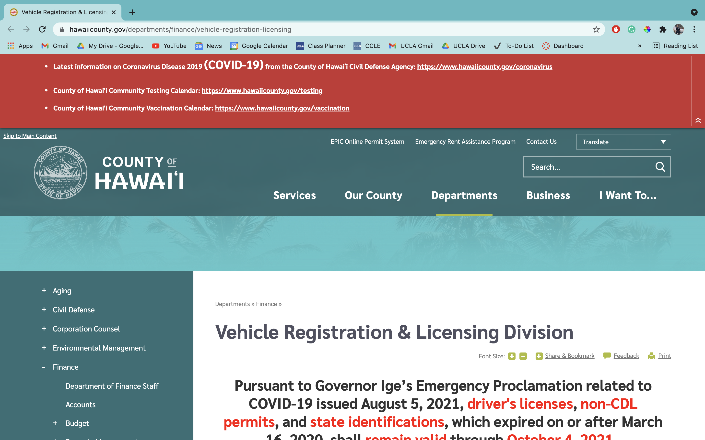
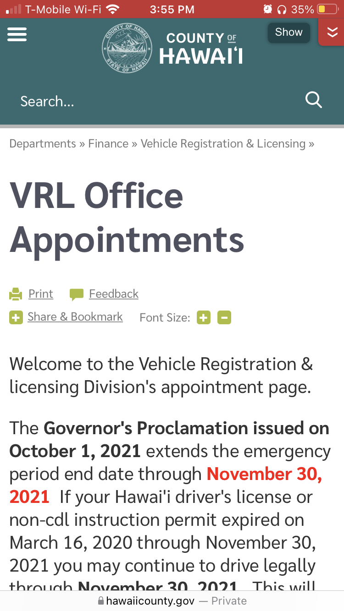
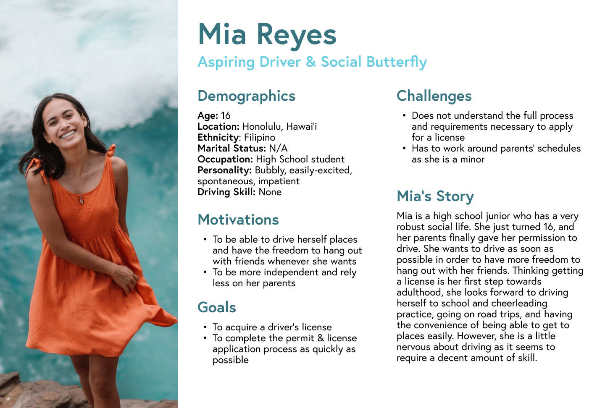
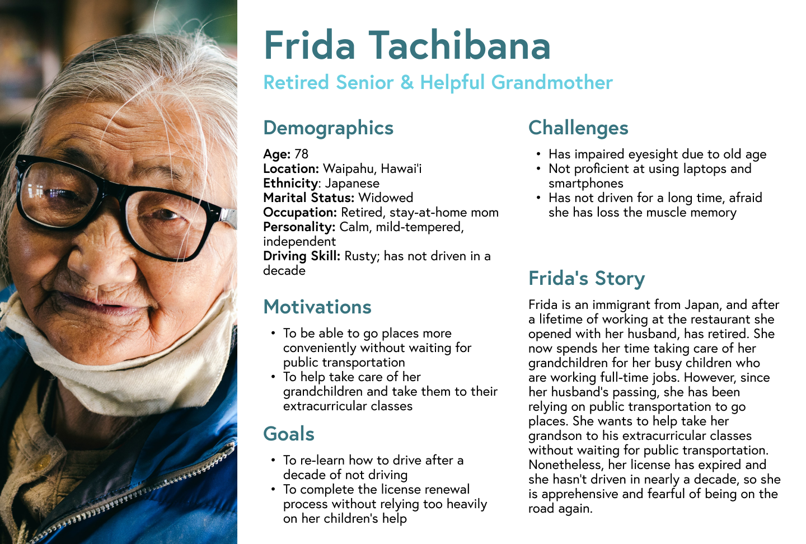
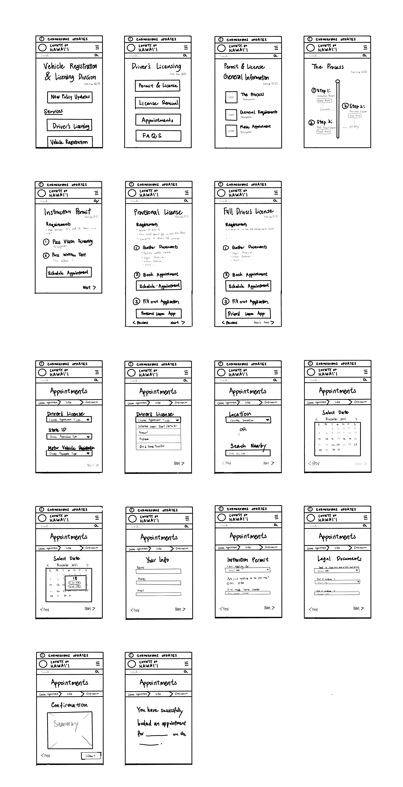
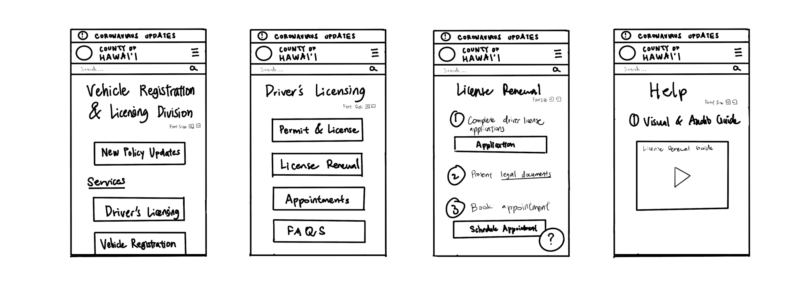
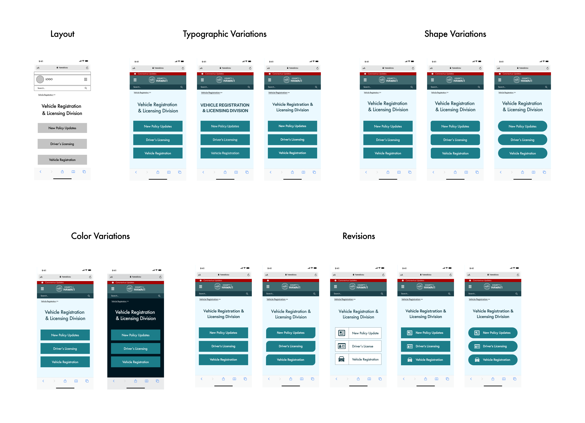

#  Drive Easy: Improving the Efficiency and Accessibility of Hawai'i's Vehicle Registration & Licensing Department

## Assignment 08: Pitch
Isaac Wen | DH 110 | Fall 2021

## Introduction: 
This project aims to redesign the current website for the Vehicle Registration & Licensing (VRL) Department of the County of Hawai'i to enhance its efficiency and accessibility. The Vehicle Registration & Licensing Department has a notorious reputation of being highly ineffective and a hassle to work with, resulting in many people having rather negative experiences while applying for permits or licenses, attempting to renew licenses, registering vehicles, and more. Through this project, I hope to expedite the various processes of the VRL, make it easier for first-time applicants to learn about licensing procedures, and introduce accessible features that assist those who are not as technologically literate.

## Design statement: 
People find it difficult and confusing to navigate the current website for the Vehicle Registration & Licensing (VRL) department of the County of Hawai'i, preventing them from learning about the processes involved in VRL-related activities and making appointments accordingly.

## Competitor analysis:
I conducted a heuristic evaluation on the County of Hawai'i’s website (along with the Hawaii State Department of Health) to identify the most pressing obstacles users currently face when navigating the site. By evaluating the issues I notice against the ten heuristics, I could more accurately pinpoint the exact problems that plagued the website and begin proposing potential changes that would help improve the overall user experience. 

The top 3 issues were the following:

| Heuristic | Usability Problem |
|---|---|
| Help Users Recognize, Diagnose, and Recover from Errors | When choosing a date for a Road Test Appointment, the user is not notified when the next available date and time is. |
| Aesthetic and Minimalist Design | The lack of paragraph breaks throughout the information-dense pages makes finding certain requirements/documents difficult. | 
| Help and Documentation | The FAQ section for the Department of Vehicle Registration & Licensing is obscured and not discoverable through the search function. | 

[Read more about the heuristic evaluation...](https://github.com/isaacwen01/DH110/blob/main/Assignments/Assignment1.md)

 

## User research:

### Usability Testing
After conducting the initial heuristic evaluation, I decided that I needed to conduct a usability test (UT) so I could better evaluate the current website using the three metrics of effectiveness, efficiency, and satisfaction. By giving participants tasks and observing their behavior and thoughts as they work through them, UT allowed me to better empathize with typical users of the site––a first-time permit applicant who is unfamiliar with a lot of the jargon used on the site or an elderly who might not be technologically literate. Frustrations of the user are highlighted and are used to point out areas of improvement for the next iteration of the design.

I asked my participant to perform three tasks that corresponded to the top three heuristics violated:
1. Find the earliest date for a road test appointment.
2. Identify the documents and procedures necessary to renew a license.
3. Find the FAQ section and check if a fax copy of an insurance card will suffice for a VRL office visit.

In regards to the County of Hawai’i website, the participant reaffirmed the usability problems I initially noticed through the heuristic evaluation. Overall, the test user was overwhelmed by the vast amount of information and had trouble finding buttons and reaching pages because there was too much text to sift through. For instance, he was not able to complete the first task, as all the dates and locations he checked for a road test appointment were fully booked. There was no system that suggested the next available date for the user. On the other hand, for the second and third tasks, the participant was able to complete them, though they took a longer time than I had anticipated. 

[Read more about usability testing...](https://github.com/isaacwen01/DH110/tree/main/Assignments/A02)

### Contextual Inquiry
Contextual inquiry differs from UT in that the instructions given to the test user are less specific and are meant to see how they would interact with the product in a natural setting. As its name suggests, this process aims to give me, the researcher, more context about a typical user by allowing the participant to talk about their motives behind using the VRL website, their hesitations, struggles, and what they like/dislike about the site.

My biggest takeaways from the contextual inquiry were the following:
1. The availability of DMV appointments affects people’s desire to apply for a permit/license.
2. Jargon confuses potential applicants.
3. People are unfamiliar with the process of getting a license.

[Read more about contextual inquiry...](https://github.com/isaacwen01/DH110/tree/main/Assignments/A03)

## UX storytelling 
UX storytelling is the key to empathizing and understanding the user. Storytelling essentially places the designer in the user’s shoes, allowing them to imagine problems the user faces and visualize how the user may respond to them. This allows them to design product features that more directly resolve the pain points of the user. Most importantly, UX storytelling helps the designer get rid of any biases they might have had and design in a human-centered manner.

Throughout my research, I created two personas––Mia, the aspiring driver applying for a permit for the first time, and Frida, the retired grandmother hoping to renew her license. For each persona, I gave them a story to make them feel like plausible users of the website. More importantly, I identified their needs, pain points, and goals. I also created empathy maps to gauge how each user would feel as they worked through the site. 

[Read more about the personas...](https://raw.githubusercontent.com/isaacwen01/DH110/main/Assignments/A04/README.md)

 

## Wireframe and graphic design element variation

### Wireframes:

After finalizing my personas, I began to create wireframes that represented the key screens of my website redesign. These were drawn by hand on pro-create and focused on the layout and information hierarchy of the website, not so much the aesthetics. This could be seen as a "rough draft" of what the final product could potentially become.

 

### Design Variations:

From there, I began working on revising the interface design of the website. Good interface design categorizes the website’s current information into more digestible chunks that will give the user a high-level overview of the process. It also hides less relevant information and visually guides the user to follow a certain path that will allow them to easily apply for/renew a permit or license. Before deciding on a final design, I made several variations on typography, shape (specifically the roundness of buttons/elements), and color.

[Read more about the interface design...](https://github.com/isaacwen01/DH110/tree/main/Assignments/A06)

 

## Low-fidelity prototype

Low-fidelity (lo-fi) prototyping is a quick and relatively easy way for designers to test the layout, information hierarchy, and functionality of proposed features of a work-in-progress product at a relatively low cost. Its purpose is to “fail quickly”––to identify problems early on in the design process and help designers rapidly redesign the product. For this project, lo-fi prototyping allowed me to realize whether or not my redesign of the original website was effective; in other words, its main purpose was the evaluate the functionality of the redesigned website.

The three tasks supported by this prototype were the following:
1. Use the Interactive Timeline
2. Make an appointment (Instruction Permit)
3. Access visual & audio guide (License Renewal)

### Confusions and/or unexpected interactions
Upon showing the lo-fi prototype to a test user and having him try to complete the three tasks, I noted down what he struggled with or found confusing. From there, I made the appropriate revisions in my hi-fi prototype.

1. On the “Permit & License General Information” screen, the user was not sure what to press (the icon or text) to view the interactive timeline.
2. On the interactive timeline, the user overlooked the “read more” button and was not able to make the connection between the timeline with the subsequent pages that contain more detail about each stage of the process.
3.  While booking an appointment, the user was confused by the organization of information and the language used. 
    - On the first page, the different appointments are sorted by “Driver’s License”, “State ID”, and “Motor Vehicle Registration.” The user thought “Driver’s License” referred to the road test and not a way of categorizing appointments. 
    - After filling out his personal information, the user is presented with a screen with the title “Instruction Permit.” The user thought this was a mistake as he believed it brought him to a previous page; however, the “Instruction Permit” was simply the section of the appointment-scheduling form that asked for information about which type of instruction permit he is applying for.

[Read more about the lo-fi prototype and testing...](https://github.com/isaacwen01/DH110/tree/main/Assignments/A05)

<iframe style="border: 1px solid rgba(0, 0, 0, 0.1);" width="800" height="450" src="https://www.figma.com/embed?embed_host=share&url=https%3A%2F%2Fwww.figma.com%2Ffile%2FFiP5xIDKEKWrtnXJAAugWU%2FDH-110-Project%3Fnode-id%3D31%253A422" allowfullscreen></iframe>

## High-fidelity prototype

After completing and testing the lo-fi prototype, I proceeded to create a high-fidelity, interactive prototype on Figma. The purpose of this interactive prototype was to test both the interface and functionality of the redesigned County of Hawai’i website. It evaluated whether or not it was easy for the user to complete tasks, use the proposed feature, and follow the intended interaction flow.

I went through several different iterations of hi-fi prototyping. The prototype embedded below is my final prototype, and the revision history will be included in the next section.

[Read more about the hi-fi prototype and testing...](https://github.com/isaacwen01/DH110/tree/main/Assignments/A07)

<iframe style="border: 1px solid rgba(0, 0, 0, 0.1);" width="800" height="450" src="https://www.figma.com/embed?embed_host=share&url=https%3A%2F%2Fwww.figma.com%2Fproto%2FFiP5xIDKEKWrtnXJAAugWU%2FDH-110-Project%3Fnode-id%3D179%253A1110%26scaling%3Dscale-down%26page-id%3D179%253A1087%26starting-point-node-id%3D179%253A1110%26show-proto-sidebar%3D1" allowfullscreen></iframe>

## Evaluation and revision history 

During the high-fidelity phase of the project, I made several changes to my design based on the feedback I received from my various test users. I conducted an impression test, cognitive walkthrough, and several usability tests to pinpoint the flaws of my design and make changes accordingly.

### Impression Test
For this round of testing, I gave the user 5 seconds to look at the first screen and asked him his general impression of the site as well as what he thought the function of the site was. Then, I showed him the screen variations and asked him to compare them to the first screen, pointing out things he liked or disliked about each variation.

1. Overall Impression: The user could immediately identify what the purpose of the website was. He could also immediately tell that it was a government-related 
website based on the interface design.

2. Typography: The user preferred fonts that were easier to look at and not too dramatic. He did not like the second variation with all the letters capitalized, 
describing it as too “in your face” and overly strong.

3. Shape: The user immediately indicated his dislike for the second variation, stating that the semi-rounded buttons were not a good look as it was halfway in 
between squared and rounded corners for no good reason. The user stated that the rectangular buttons (1st var) help establish the tone of a government website while the rounded buttons (3rd var) were more aesthetically pleasing.

4. Color: The user preferred the light mode design over the dark mode. He stated that he was more used to using light mode, especially when it comes to reading 
information-heavy sites. He also pointed out that the color scheme for light mode was more compatible; the light blue background complimented the bright blue buttons well. In contrast, he felt that the dark color in the dark mode design did not match the vibrancy of the buttons and in exchange, created a stark, but awkward contrast.

[Watch Impression Test Video](https://drive.google.com/file/d/1COGA-PxMYzvWXI-rnx4LyJaLv1ZeNWFl/view?usp=sharing)

### Cognitive Walkthrough

After making my first hi-fi prototype, I conducted cognitive walkthroughs with two classmates, where they were asked to perform a series of tasks with the prototype and questions that accessed the efficiency of my prototype.

Overall, my two testers were able to easily follow the intended interaction flow, easily completing the 3 proposed tasks. They appreciated the minimalist and straightforward interface design and thought most pages and buttons were clearly labeled. However, they did point out some areas of improvement:
1. On the “Permit & License Information” page, the tester indicated that she did not know what to click––the icon or the text. She assumed that the text would be clickable as well, not just the icon.
2. The tester struggled with returning to the home page and was confused by some of the back/previous buttons.

[View Cognitive Walkthrough Data](https://docs.google.com/spreadsheets/d/15HXr6no3cgMHEjqRma5v7XQxy8vVqJVEQpGMI2l1gDA/edit?usp=sharing)

### Usability Testing

In addition to the cognitive walkthroughs, I conducted more thorough usability tests to further pinpoint the most pressing issues with my first prototype.

Overall, the usability tests went very smoothly and the testers’ overall reactions post-test were positive. They appreciated the straightforward interaction flow and minimalistic design. Most, if not all, tasks took shorter than expected and both testers associated the website with the adjectives “professional”, “familiar”, “calm”, and “trustworthy”.

Nonetheless, the usability tests reaffirmed some of the problems that were noticed during the cognitive walkthrough. The overall lack of backflow and some minor button inconsistencies confused my testers. Aside from the aforementioned issues, there were some other issues that were brought up:
1. The text is slightly hard to read––since there’s a lot of reading to do, especially in the “Process” section, the small font size is a little hard to read. 
2. The appointment-booking screen is confusing––the tester thought that they were asked twice about what type of appointment they wanted to make––once at the beginning (before selecting the date) and once when filling out their personal information.

[Watch UT Video 1](https://drive.google.com/file/d/1Yd5SM7ljVbs4LsvQaUd9k8Y4E6J-q2FV/view?usp=sharing)

[Watch UT Video 2](https://drive.google.com/file/d/14fCDqkEHyfmko2HS9EKUh2M1nBCFlGBB/view?usp=sharing)

 
## Pitch video 

## Conclusion

This project was the first time I followed the design process completely and was without a doubt a very meaningful learning experience. 

My greatest takeaway from this 10-week project was the importance of testing in design. While working on each individual assignment, I noticed that I struggled the most with overthinking my design decisions. Whether it be the questions I put in my contextual inquiry or the visual components of my graphical interface, I spent a lot of time worrying about whether or not I was making the right decisions. However, after conducting usability tests, contextual inquiries, impression tests, and cognitive walkthroughs, I realized that these various tests were meant to answer a designer’s questions by getting direct feedback from a potential user. Instead of spending hours debating which feature to include in my design, why not show all options to a test user and have them decide for you? 

Through the many iterations of testing, I began to understand the value in “failing quickly”. This was a term we discussed in class, but I never really thought about it until I noticed how easy it was to make revisions to my design after conducting tests. Each round of testing helped me identify new problems that I should fix. 

While working on this project, I also experienced how different the designer and user of a product can be. For instance, being a driver myself, I found that I could navigate the original VRL website fairly easily because I was familiar with a lot of the terminology used on the site, despite the vast amount of text on each page. However, when I conducted my usability tests with users who do not drive, they struggled significantly more because the jargon used on the website sounded foreign and even intimidated me. Conducting UT and the contextual inquiry reminded me of the importance of empathizing with the user.
